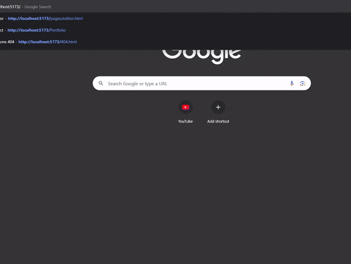
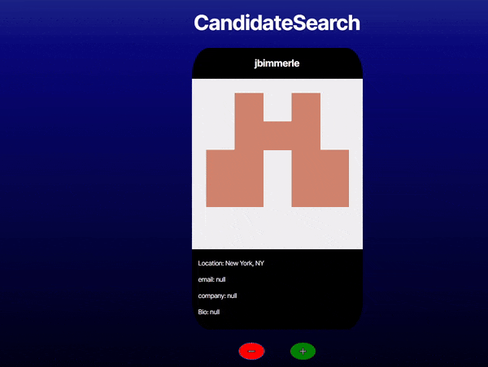
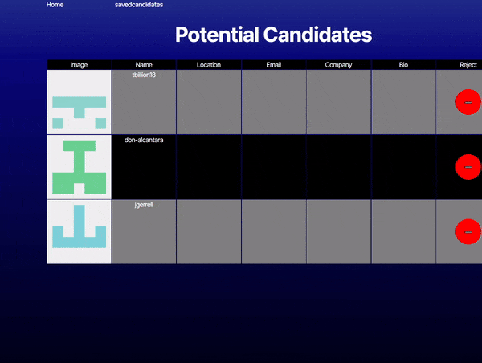

# Git Hub profile Searcher
 
## Description

Lets you browse through a random set of gitHub profiles, adding potential candidate to a saved list. Curate potential developers to work on your projects!

## 📁 Table of Contents
- [Installation](#installation)
- [Usage](#usage)
- [Contributing](#contributing)

## Installation

please visit this url to access the application. If you want to run the application from your local machine, follow these instructions:

```shell
# Step 1: clone this repository
git clone https://github.com/Dan-Swarts/git-candidate-finder.git

# Step 2: install dependencies
npm init

# Step 3: remove the '.example' from .env.example

# step 4: add your github acecess token to the .env file; Follow these instructions to get a new acess token: https://docs.github.com/en/authentication/keeping-your-account-and-data-secure/managing-your-personal-access-tokens#creating-a-fine-grained-personal-access-token

# Step 4: build the program
npm run build

# Step 5: run the program
npm run preview
```

## Usage

- load the page and see git profiles!



<br />

<br />

<br />

<br />

- browse through potential candidates and save them




<br />

<br />

<br />

<br />

- delete Saved Candidates




## Contributing

> [!IMPORTANT]
> Whether you have feedback on features, have encountered any bugs, or have suggestions for enhancements, we're eager to hear from you. Your insights help us make the react-portfolio library more robust and user-friendly.

Please feel free to contribute by [submitting an issue](https://github.com) or [joining the discussions](https://github.com). Each contribution helps us grow and improve.

We appreciate your support and look forward to making our product even better with your help!

If you created an application or package and would like other developers to contribute it, you can include guidelines for how to do so. The [Contributor Covenant](https://www.contributor-covenant.org/) is an industry standard, but you can always write your own if you'd prefer.
